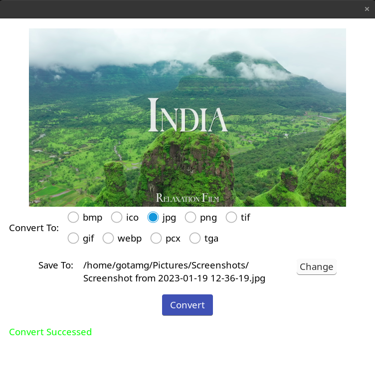
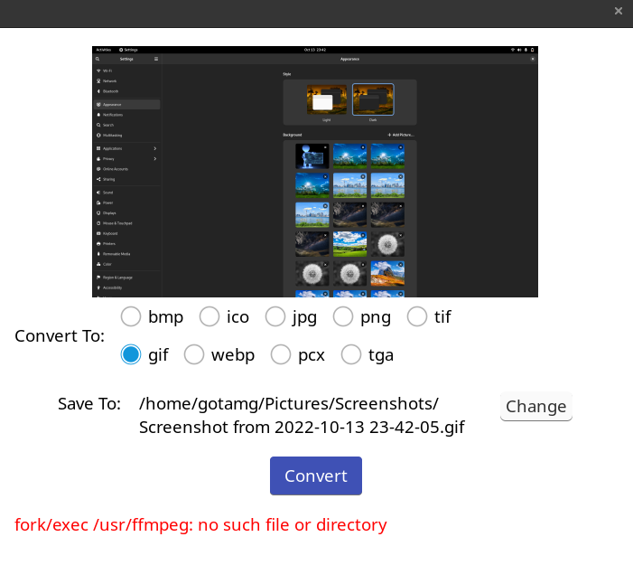

# Image Formater

It is a simple GUI based application which convert the Image file extensions form one to another with the help of FFmpeg.
This application is build with NuxUI(Golang GUI SDK) & Go programming language.

## What I Learned 
1. Learned Go Programming.
2. Learned [NuxUI](https://nuxui.org/) GUI.

## How to Install and Run the Project

### Dependencies
Following should be installed and added to path before Install and Run the Project

1. Go Programming Language
2. FFmpeg

### Install and Run

```
git clone https://github.com/GOTAM672/ImageFormater.git
cd ImageFormater/ImageFormater
go mod tidy
go build . && ./ImageFormater
```

## Screenshot



## Error Handling

If you got an error related to FFmpeg as given below...   
Then replace `"/usr/bin/ffmpeg"` with the path of FFmpeg installed in your system [Here](https://github.com/GOTAM672/ImageFormater/blob/13ba5c6844d64387a7b89a74f7fbfd00e850d23d/ImageFormater/home.go#L276).



